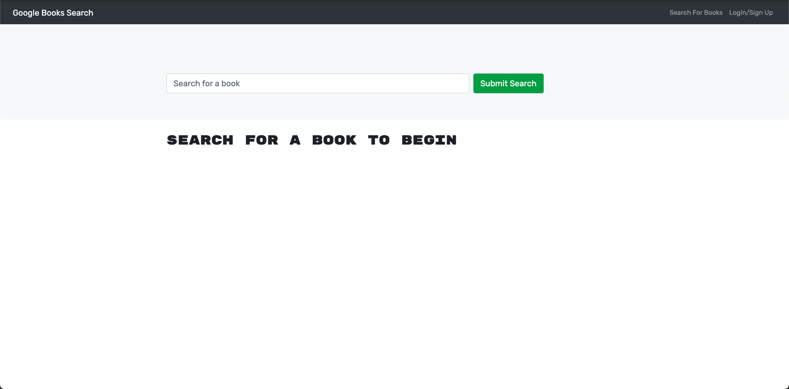
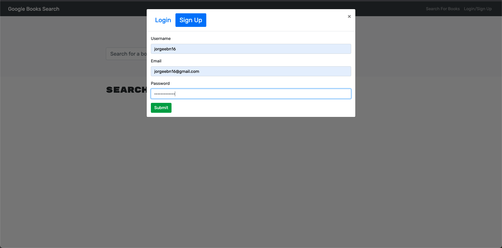
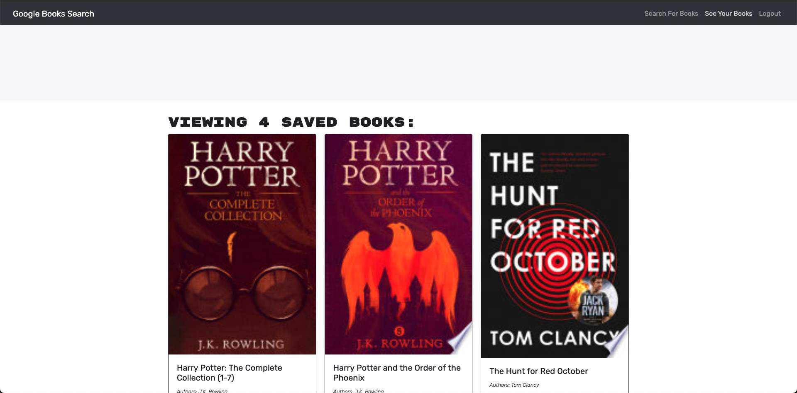

# Google-Books-Search
UCF Bootcamp Week 21 - MERN Challenge: Book Search Engine

## Table of Contents

* [Description](#Description)
* [Requirements](#Requirements)
* [Installation](#Installation)
* [Usage](#Usage)
* [License](#License)
* [Badges](#Badges)
* [Issues](#Issues)
* [Technologies](#Technologies)
* [Screenshot](#screenshot)
* [Deployment](#deployment)
* [Contributing](#Contributing)
</br>
</br>

## Description
Google Books API search engine built with a RESTful API, and refactor it to be a GraphQL API built with Apollo Server. 
<br>
<br>

## Requirements

#### User Story
>AS AN avid reader. I WANT to search for new books to read. SO THAT I can keep a list of books to purchase
<br>
<br>

>GIVEN a book search engine
<br>

>WHEN I load the search engine
>>THEN I am presented with a menu with the options Search for Books and Login/Signup and an input field to search for books and a submit button
<br>

>WHEN I click on the Search for Books menu option
>>THEN I am presented with an input field to search for books and a submit button
<br>

>WHEN I am not logged in and enter a search term in the input field and click the submit button
>>THEN I am presented with several search results, each featuring a book’s title, author, description, image, and a link to that book on the Google Books site
<br>

>WHEN I click on the Login/Signup menu option
>THEN a modal appears on the screen with a toggle between the option to log in or sign up
<br>

>WHEN the toggle is set to Signup
>>THEN I am presented with three inputs for a username, an email address, and a password, and a signup button
<br>

>WHEN the toggle is set to Login
>THEN I am presented with two inputs for an email address and a password and login button
<br>

>WHEN I enter a valid email address and create a password and click on the signup button
>>THEN my user account is created and I am logged in to the site
<br>

>WHEN I enter my account’s email address and password and click on the login button
>>THEN I the modal closes and I am logged in to the site
<br>

>WHEN I am logged in to the site
>>THEN the menu options change to Search for Books, an option to see my saved books, and Logout
<br>

>WHEN I am logged in and enter a search term in the input field and click the submit button
>>THEN I am presented with several search results, each featuring a book’s title, author, description, image, and a link to that book on the Google Books site and a button to save a book to my account
<br>

>WHEN I click on the Save button on a book
>>THEN that book’s information is saved to my account
<br>

>WHEN I click on the option to see my saved books
>>THEN I am presented with all of the books I have saved to my account, each featuring the book’s title, author, description, image, and a link to that book on the Google Books site and a button to remove a book from my account
<br>

>WHEN I click on the Remove button on a book
>>THEN that book is deleted from my saved books list
<br>

>WHEN I click on the Logout button
>THEN I am logged out of the site and presented with a menu with the options Search for Books and Login/Signup and an input field to search for books and a submit button  
<br>
<br>

## Installation
To use this application, please install: 
```
npm install
```

<br/>
<br/>

## Usage
In order to use the application, run the following commands:
```
npm start
```

<br/>
<br/>

## License 
[](https://opensource.org/licenses/MIT)
</br>
</br>

## Badges


</br>
</br>

## Issues
[](https://GitHub.com/jorgeebn16/google-book-search/issues/)
[](https://GitHub.com/jorgeebn16/google-book-search/issues?q=is%3Aissue+is%3Aclosed)
</br>
</br>

## Technologies
* [React](https://reactjs.org//)
* [npm](https://www.npmjs.com/)
* [MongoDB](https://www.mongodb.com/cloud/atlas)
* [JWT](https://jwt.io/)
* [GraphQL](https://graphql.org/)
* [ApolloServer](https://www.apollographql.com/docs/apollo-server/)


<br/>
<br/>

## Screenshot
<br/>
<br/>
<br/>
<br/>
<br/>
<br/>

</br>
</br>

## Deployment
View [Deployed Portfolio](https://jorgeebn16-booksearching.herokuapp.com/)

## Contributing
[](https://GitHub.com/jorgeebn16/google-book-search/graphs/contributors/)

For anyone who wishes to contribute you can contact me with at jorgeebn16@gmail.com
</br>
</br>

Would you like to reach me?
</br>
Contact Me:

Github: https://github.com/jorgeebn16</br>
Email: jorgeebn16@gmail.com


## Issues
[](https://GitHub.com/jorgeebn16/21-merm-challenge/issues/)
[](https://GitHub.com/jorgeebn16/21-merm-challenge/issues?q=is%3Aissue+is%3Aclosed)

